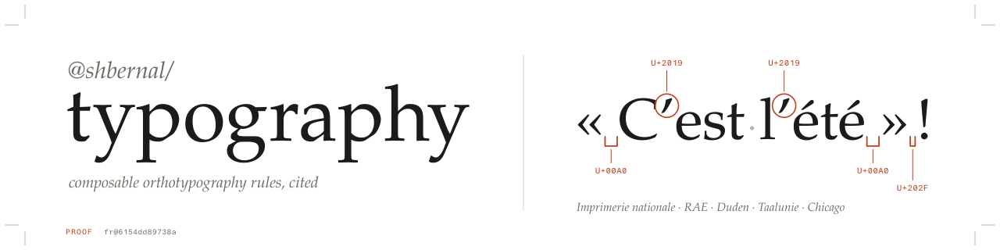
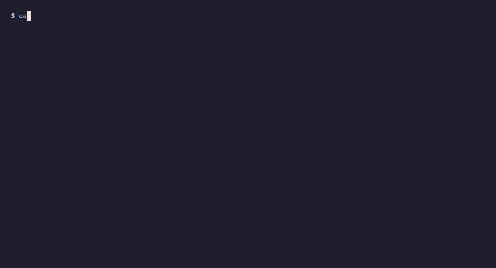
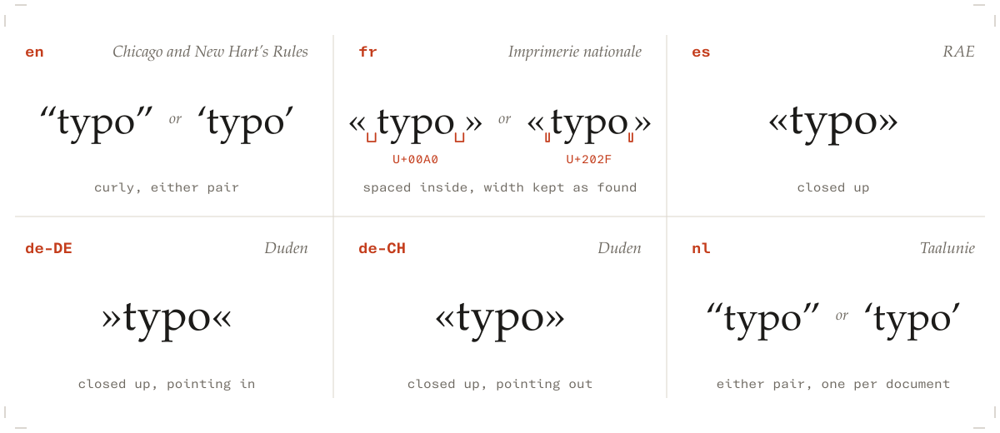
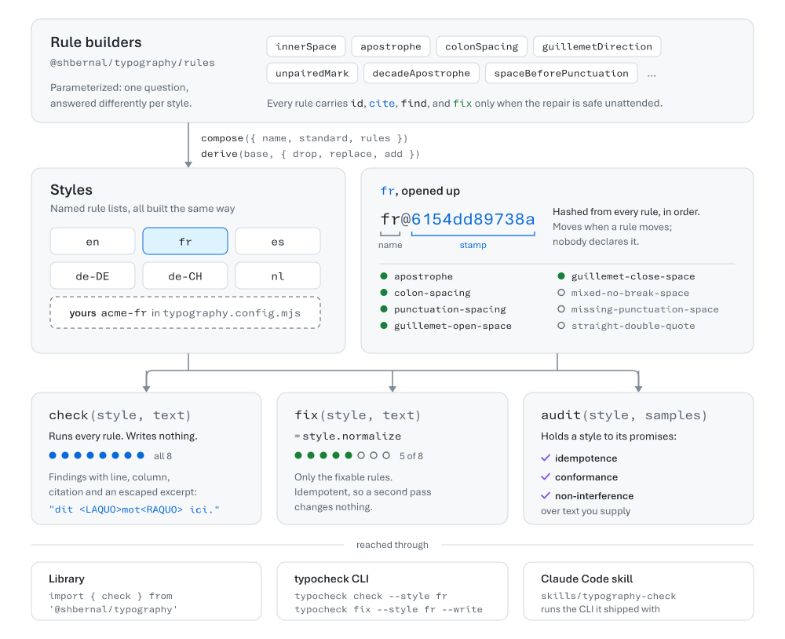

<div align="center">

<picture>
  <source media="(prefers-color-scheme: dark)" srcset="assets/banner-dark.svg">
  
</picture>

Check and fix the typography a model gets wrong without anyone seeing it.

[![npm][npm-badge]][npm]
[![CI][ci-badge]][ci]
[![Dependencies][deps-badge]][deps]
[![License][license-badge]][license]

---

[Install](#install) • [Quickstart](#quickstart) • [Styles](#six-styles) • [How it works](#how-it-works) • [Docs](#more)

---

</div>

<p align="center">
  
</p>

## What it is

Orthotypography rules for English, French, Spanish, German and Dutch, as data you can read, run and recompose.
Point it at generated or translated text and it reports the spacing, apostrophes and quotation marks a reader cannot see are wrong, then fixes the part that is safe to fix unattended.

- **Six styles**: `en`, `fr`, `es`, `de-DE`, `de-CH` and `nl`, each rule citing its source.
- **`check` and `fix` are separate sets.** `check` reports everything; `fix` applies only repairs that need no judgment.
- **Readable reports.** Every finding has a line, a column, the citation and an escaped excerpt like `<NNBSP>`, so the invisible character is visible.
- **Composable.** A style is a named list of rules. Build your own with `compose` and `derive`, from the same builders the shipped styles use.
- **Era stamps.** A style id like `fr@6154dd89738a` is hashed from its rules, so text normalized under it says exactly which rules it went through.
- **Zero runtime dependencies.** A library, a `typocheck` CLI, and a Claude Code skill in one package.

## Why?

Ask a model for the same paragraph twice and one copy has `'` where the other has `’`, or a no-break space before a colon where the other has a plain one.
Both look correct, because U+00A0, U+202F and U+0020 render identically.
Over thousands of rows that becomes a body of text set a dozen ways, where every row is defensible and no two agree.

<picture>
  <source media="(prefers-color-scheme: dark)" srcset="assets/invisible-dark.svg">
  
</picture>

The question this package answers is not whether a publisher would accept the text.
It is whether the same content comes back the same way every time.

| | Smart quotes or find-and-replace | `@shbernal/typography` |
| --- | --- | --- |
| No-break and narrow no-break spaces | Invisible, usually untouched | Checked, fixed, and named in reports |
| Spacing per language (French `« »`, Spanish `«»`) | One rule for everything | Six styles |
| Repairs that need a decision, like Spanish `¿` | Guessed or skipped silently | Reported, never guessed |
| Where a rule comes from | Nowhere | A citation on every rule |
| Which rules touched stored text | Unknown | A derived era stamp |

## Install

```bash
pnpm add @shbernal/typography
```

Node 22 or later. To run the CLI without installing:

```bash
pnpm dlx @shbernal/typography check --style fr README.fr.md
```

## Quickstart

1. Check a file against a style. It exits non-zero on findings, so it drops into CI as is.

   ```bash
   typocheck check --style fr docs/guide.fr.md
   ```

2. Apply the safe fixes in place.

   ```bash
   typocheck fix --style fr --write docs/guide.fr.md
   ```

3. Or do both from code, on text a model just returned.

   ```ts
   import { fr } from '@shbernal/typography/fr';
   import { check, unfixable } from '@shbernal/typography';

   const findings = check(fr, text);
   const needsAHuman = unfixable(findings);
   const cleaned = fr.normalize(text);
   ```

Store `fr.id` next to anything you normalized.
Fenced code blocks and inline code spans are never touched.

For a coding agent, the Claude Code skill ships in the same package, so the skill and the binary it runs are always the same version:

```text
/plugin marketplace add shbernal/typography
```

```text
/plugin install typography-check@shbernal-typography
```

## Six styles

French and Spanish use the same characters with opposite spacing, and German points them the other way.
That is one question with several answers, so each style is its own rule list, not one engine with a locale flag.

<picture>
  <source media="(prefers-color-scheme: dark)" srcset="assets/six-dark.svg">
  
</picture>

| | `en` | `fr` | `es` | `de-DE` | `de-CH` | `nl` |
| --- | --- | --- | --- | --- | --- | --- |
| Source | Chicago and New Hart's Rules | Imprimerie nationale | RAE | Duden | Duden | Taalunie |
| Quotation marks | curly, either pair | `« … »` | `«…»` | `»…«` | `«…»` | either, but one per document |
| Space inside them | no rule | required | forbidden | forbidden | forbidden | n/a |
| Space before `; : ! ?` | forbidden | required | forbidden | forbidden | forbidden | forbidden |
| Opening `¿` `¡` | | | paired | | | |

There is no bare `de` and no language detection: a French rule applied to Swiss German produces confident nonsense, so you always name the style.
Where a source admits two spellings, the style rules only on what is wrong under both.
[docs/provenance.md](docs/provenance.md) records where each rule came from and what it was measured against.

## How it works

<picture>
  <source media="(prefers-color-scheme: dark)" srcset="assets/how-it-works-dark.svg">
  
</picture>

A rule is the primitive: a pattern, a sentence, a citation, and a repair if one is safe.
A style is a list of rules with a name, built by `compose` or changed by `derive`.
`check` runs every rule; `normalize` runs only the fixable ones, and is idempotent.
`audit` holds any style, yours included, to idempotence, conformance and non-interference over text you supply.

```ts
import { derive } from '@shbernal/typography';
import { fr } from '@shbernal/typography/fr';

const house = derive(fr, {
  name: 'acme-fr',
  standard: 'ACME house style v3',
  drop: ['missing-punctuation-space'],
});
```

Put that in a `typography.config.mjs` and `typocheck --style acme-fr` runs your rules, with your stamp in the report footer.

## More

- [API and CLI reference](docs/api.md)
- [Design: why a rule is the primitive and the stamp is derived](docs/design.md)
- [Provenance: sources, measurements and narrowings](docs/provenance.md)
- [Adding a rule or a style](docs/development.md)
- [Report a false positive](https://github.com/shbernal/typography/issues/new?template=false-positive.yml), the most useful issue this project can get

[npm]: https://www.npmjs.com/package/@shbernal/typography
[npm-badge]: https://img.shields.io/npm/v/@shbernal/typography?style=for-the-badge&logo=npm&logoColor=white&labelColor=1c1b19&color=c43d1c
[ci]: https://github.com/shbernal/typography/actions/workflows/ci.yml
[ci-badge]: https://img.shields.io/github/actions/workflow/status/shbernal/typography/ci.yml?branch=main&style=for-the-badge&logo=githubactions&logoColor=white&label=CI&labelColor=1c1b19&color=c43d1c
[deps]: package.json
[deps-badge]: https://img.shields.io/badge/dependencies-0-c43d1c?style=for-the-badge&labelColor=1c1b19
[license]: LICENSE
[license-badge]: https://img.shields.io/github/license/shbernal/typography?style=for-the-badge&labelColor=1c1b19&color=c43d1c
